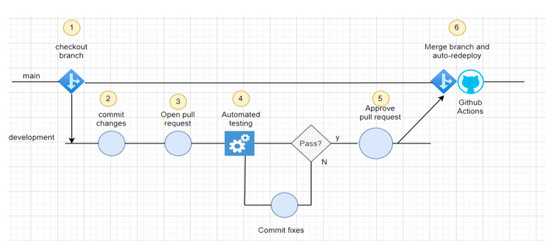
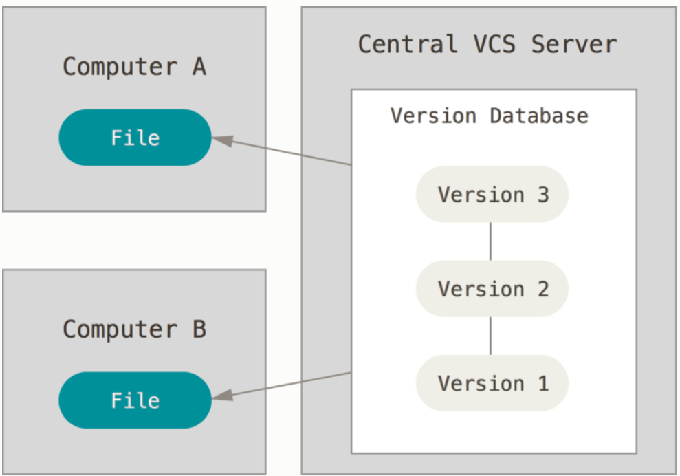
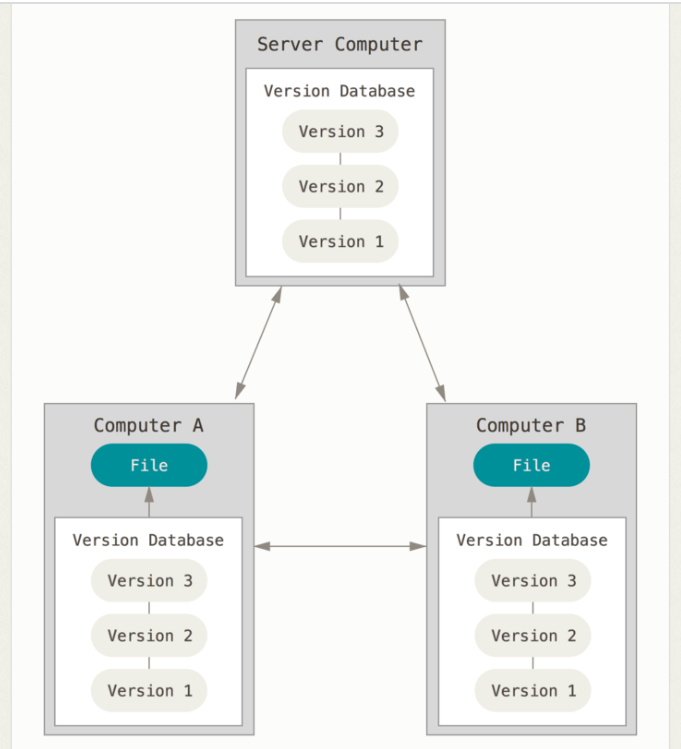
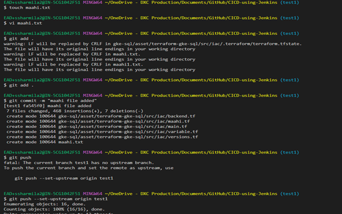
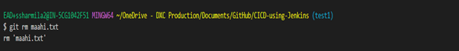
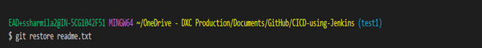
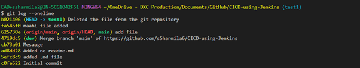
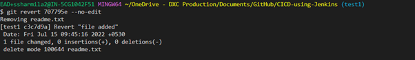
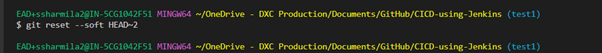

# Github

GitHub is a highly used software that is typically used for version control. It is helpful when more than just one person is working on a project. Say for example, a software developer team wants to build a website and everyone has to update their codes simultaneously while working on the project. In this case, Github helps them to build a centralized repository where everyone can upload, edit, and manage the code files.

## GitHub Repository?

A repository is a storage space where your project lives. It can be local to a folder on your computer, or it can be a storage space on GitHub  or another online host. You can keep code files, text files, images or any kind of a file in a repository. You need a GitHub repository when you have done some changes and are ready to be uploaded. This GitHub repository acts as your remote repository.

# GitHub Actions

## GitHub Flow Considerations:

1.	Any code in the main branch should be deployable.
2.	Create new descriptively named branches off the main branch for new work, such as feature.
3.	Commit new work to your local branches and regularly push work to the remote.
4.	To request feedback or help, or when you think your work is ready to merge into the main branch, open a pull request.
5.	After your work or feature has been reviewed and approved, it can be merged into the main branch.
6.	Once your work has been merged into the main branch, it should be deployed immediately.

## Version Control

## Centralized Version Control Systems
The next major issue that people encounter is that they need to collaborate with developers on other systems. To deal with this problem, Centralized Version Control Systems (CVCSs) were developed. These systems (such as CVS, Subversion, and Perforce) have a single server that contains all the versioned files, and a number of clients that check out files from that central place. For many years, this has been the standard for version control.

## Distributed Version Control Systems
This is where Distributed Version Control Systems (DVCSs) step in. In a DVCS (such as Git, Mercurial, Bazaar or Darcs), clients don’t just check out the latest snapshot of the files; rather, they fully mirror the repository, including its full history. Thus, if any server dies, and these systems were collaborating via that server, any of the client repositories can be copied back up to the server to restore it. Every clone is really a full backup of all the data.

## Push your Code to GitHub Repository using Command Line

- To initialize empty local git repository, type the below command.

         git init

- You can either add individual files or directories or add all unstaged files using below command.

          git add .

- For adding individual file, type the file name in place of the dot.

        git add README.md

- To see the branches in your repository, use the below command.

        git branch

- You can create a new branch using the command.

        git checkout -b

- Alternatively, you can use two commands to create a branch and then checkout so that you can start working on it.

       git branch git checkout

- You can either add individual files or directories or add all unstaged files using below command.

      git add .

- Now we need to commit our code changes made to the files to a local repository. Each commit will have an unique ID for the reference. It is important to add a commit message as well, that will tell us what changes we have made.

        git commit -m "first commit"

- Finally we push our code to the GitHub and also mention the branch.

   git push -u origin main

 

- git remote -v   ----> shows the urls of Present remote Repositories
- git clone [url] ----> retrieve an entire repository from a hosted location via URL
- git remote add origin github URL----> it adds the remote repository to a local repository
- git pull origin branchname ----> pull the code 
- git fetch origin branchname
- git pull = git fetch+git merge
- git branch -m test newtest - to change the branch name to the new change
- git branch -d branchname   - to delete the branch name
- git merge featurebranch-name - to merge the branch from main to feature
- git rebase featurebranch-name - to rebase the branch from main to feature branch
- git rm <file_name>            - command to delete the file.

 

- git status
- git restore  .
- git restore name of the file what you have restore

- git log -–oneline – to check with the commit hash you like to undo

- git revert commit id  --no-edit - To undo a specific commit use

- A great hack is to add a number to the end of `~` to undo multiple commits. 
- For example, to undo the last 2 commits - run-  git reset --soft HEAD~2.

## Ignored Files
- A file which Git has been explicitly told to ignore.
- Ignored files are tracked in a special file named .gitignore that is checked in at the root of your repository. 
- There is no explicit git ignore command: instead the .gitignore file must be edited and committed by hand when you have new files that you wish to ignore. 
- .gitignore files contain patterns that are matched against file names in your repository to determine whether or not they should be ignored.

- Global Git ignore rules

$ touch ~/.gitignore

$ git config --global core.excludesFile ~/.gitignore

## Ignoring a previously committed file

- If you want to ignore a file that you've committed in the past, you'll need to delete the file from your repository and then add a .gitignore rule for it.

-  Using the --cached option with git rm means that the file will be deleted from your repository, but will remain in your working directory as an ignored file.

$ echo debug.log >> .gitignore
  
$ git rm --cached debug.log
rm 'debug.log'
  
$ git commit -m "Start ignoring debug.log"

## Committing an ignored file

It is possible to force an ignored file to be committed to the repository using the -f (or --force) option with git add:

$ cat .gitignore
*.log
  
$ git add -f debug.log
  
$ git commit -m "Force adding debug.log"

## Stashing an ignored file

- git stash is a powerful Git feature for temporarily shelving and reverting local changes, allowing you to re-apply them later on. 
- As you'd expect, by default git stash ignores ignored files and only stashes changes to files that are tracked by Git.
-  However, you can invoke ## git stash with the --all option to stash changes to ignored and untracked files as well.

## Debugging .gitignore files
- If you have complicated .gitignore patterns, or patterns spread over multiple .gitignore files, it can be difficult to track down why a particular file is being ignored.
-  You can use the ## git check-ignore command with the -v (or --verbose) option to determine which pattern is causing a particular file to be ignored:

$ git check-ignore -v debug.log

.gitignore:3:*.log  debug.log